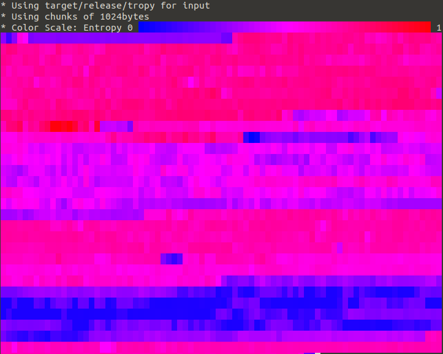

# tropy - command line entropy viewer
[](https://crates.io/crates/tropy)
[](https://docs.rs/crate/tropy)

[](https://github.com/razorheadfx/tropy/actions)
[](https://deps.rs/repo/github/razorheadfx/tropy)

## What is tropy and what would you use it for?
The tropy commandline tool takes bytes or input from std in and calculates the [Shannon entropy](https://en.wikipedia.org/wiki/Entropy_(information_theory)) then it display them colour coded in the terminal.
Ever wondered whether a certain file (e.g. a application binary or firmware blob) contains __encrypted__ or __compressed__ data?
Information theoretical entropy is a good indicator of both cases, as both compression and encryption aim to distribute the symbol (byte value) probabilities evenly across the entire range of states a symbol (byte) can be in.

A good compression algorithm will strive to convert common bit/byte patterns in the input into a (bit-wise) shorter representation by number of means.
Ideally, the output is evenly distributed across all possible states of the byte (symbol), since dominance of a single state would be an indicator of another common pattern which could be compressed further.

Encryption on the other hand aims to pseudo-randomize the input, which also increases entropy by (among others) preventing telling patterns of the input from leaking into the output.

With tropy such sections of high entropy are very easily identified as red areas (i.e. chunks of the data where entropy is nearly 8bit/byte).

## Installing
With [Rust installed](https://rustup.rs) run:
```shell
cargo install tropy
``` 

## Using the tropy command line tool
```shell
# for example to get the entropy of the tropy binary
# in chunks of 1024 bytes (the default value)
tropy target/release/tropy --bytes 1024
```
will yield something like this:


```shell
# or read data from stdin and get the raw entropy as csv
# this should be pretty close to 8bit/byte
cat /dev/urandom | tropy - --csv
```
#

## Using tropy as a library
Add this to your ```Cargo.toml```:
```toml
#[dependencies]
.
tropy = { version = "0.1.0", default_features = false }
.

```
And to use the entropy calculator in your program/library add this:
```rust
use std::io::Write;
use tropy::Calculator;

let mut calc = Calculator::new();

// write some bytes
calc.write(&[0u8]).unwrap();
calc.write(&[1u8]).unwrap();

// calculate the entropy over the accumulated state
// and reset the calculator
let e = calc.entropy();
assert_eq!(e,1.0);

```

# License
[Mozilla Public License 2.0](https://www.mozilla.org/en-US/MPL/2.0)
